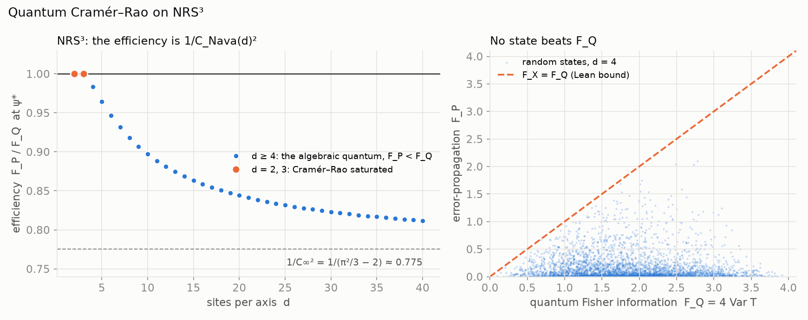

# NRS³ · Cramér–Rao

**No measurement extracts more information about a phase than `4 Var H`** — the quantum
Cramér–Rao bound for pure states, from Robertson's inequality, in Lean 4.

**[▶ Try it: turn the phase and watch δT and δP](https://naype888-cloud.github.io/nrs3-cramer-rao/)**



## Results

| Statement | Lean |
|---|---|
| `⟪δA, δB⟫ − ⟪δB, δA⟫ = ⟨[A, B]⟩` | `inner_dev_sub` |
| Robertson: `‖⟨[A, B]⟩‖² ≤ 4 Var A · Var B` | `robertson` |
| Cramér–Rao: `F_X = ‖⟨[H, X]⟩‖² / Var X ≤ F_Q = 4 Var H` | `fisher_le_qfi` |

For symmetric operators on any complex inner product space, in particular `ℂ^d`. `F_X` is the
error-propagation Fisher information of reading `θ` with `X` after `e^{−iθH}`; `F_Q = 4 Var H` is
the quantum Fisher information of a pure state, taken here as its definition.

## In NRS³

On NRS³ the parameter is imprinted by transport `T_d` and read with position `P_d`. At the
maximal-tension state the efficiency `F_P / F_Q` is `1 / C_Nava(d)²`: exactly `1` at `d = 2, 3`
and strictly below from `d = 4` on, towards `1/(π²/3 − 2) ≈ 0.775` (`GroupVelocity.cramerRao`,
`GroupVelocity.mtRatio_psiStar`, `D41` in the base repository). At `d = 4` it is
`5 / (99 − 42√5) ≈ 0.9833`.

## History

Helstrom (1967) and Braunstein–Caves (1994). The identity `d⟨X⟩/dθ = ⟨i[H, X]⟩` that turns
Robertson into an estimation bound is the Heisenberg equation; on `T_d : P_d` it is `D38` of the
base repository, and it is not re-proved here.

## Build

Lean 4 `v4.34.0`, Mathlib `v4.34.0`, nothing else.

```bash
lake exe cache get
lake build
lake env lean Verification/Axioms.lean   # only propext, Classical.choice, Quot.sound
```

Every file: no `sorry`, lines of at most 100 characters, English headers.

## The mosaic

- [NRS and NRS³ — the base theorem](https://github.com/naype888-cloud/nava-robertson-schrodinger)
- **[NRS³ · Cramér–Rao](https://github.com/naype888-cloud/nrs3-cramer-rao)** (this one)
- [NRS³ · Mandelstam–Tamm](https://github.com/naype888-cloud/nrs3-mandelstam-tamm)
- [NRS³ · Penrose](https://github.com/naype888-cloud/nrs3-penrose)
- [NRS³ · Pauli–Dirac](https://github.com/naype888-cloud/nrs3-pauli-dirac)
- [NRS³ · Poincaré](https://github.com/naype888-cloud/nrs3-poincare)

## License

NRS Noncommercial License 1.0.0, see [`LICENSE`](LICENSE). Author: Eduardo Nava-Hernandez.
